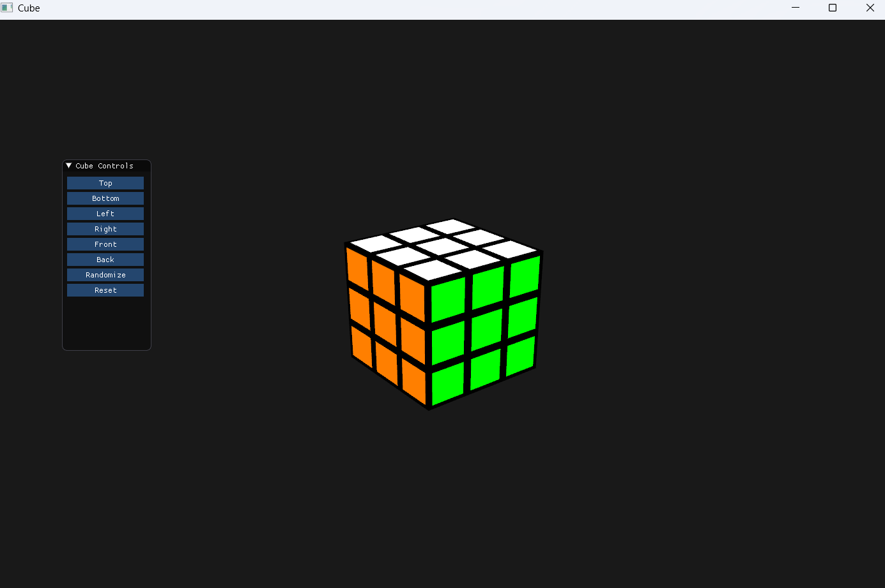

cube-visualizer
=========
A 3D Rubik’s Cube visualizer built from scratch using C++ and OpenGL.

Clone
-----
```bash
git clone --recurse-submodules git@github.com:diffusely/cube-visualizer.git
cd cube-visualizer
```

Build
-----
```bash
mkdir build
cd build
cmake ..
cmake --build .
```

